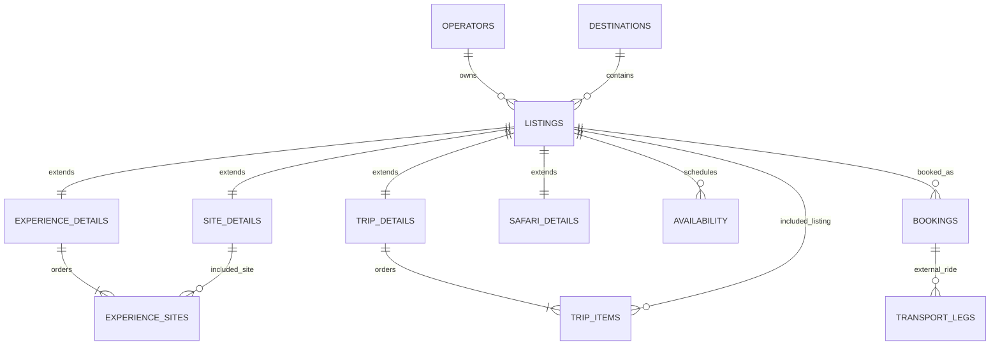

# Twende data model

Twende uses class-table inheritance: every sellable product begins as a `listings` row and has exactly one type-specific extension row. This keeps discovery, availability, booking, payment, and review references consistent while allowing each module to own its distinct fields.

`listings` stores the shared identity, operator, destination, type (`site`, `experience`, `trip`, or `safari`), title, description, base price, lifecycle status, and timestamps. `site_details`, `experience_details`, `trip_details`, and `safari_details` share that listing UUID as both primary key and foreign key.

An Experience must contain at least two ordered `experience_sites` entries. A Trip's ordered `trip_items` can reference any listing and can also describe a Transport leg. Transport itself is not a listing type: `transport_legs` stores the external booking reference, endpoints, and quoted fare returned by the existing Transport backend.
